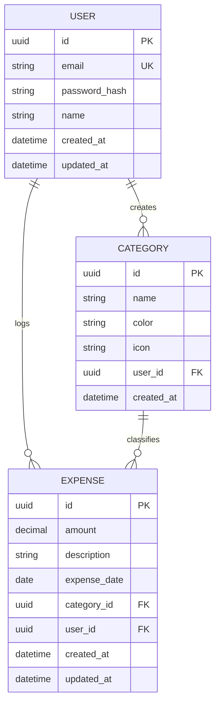

# Data Model — Personal Expense Tracker

## Relationship diagram



## Tables

### User
Represents each registered person in the app.

| Field | Type | Notes |
|---|---|---|
| id | UUID | Primary key |
| email | string | Unique, used for login |
| password_hash | string | Never store the password in plain text — use bcrypt |
| name | string | Display name for the UI |
| created_at | datetime | Auto |
| updated_at | datetime | Auto |

### Category
Expense categories, owned by each user (so everyone can customize their own).

| Field | Type | Notes |
|---|---|---|
| id | UUID | Primary key |
| name | string | E.g. "Food", "Transportation", "Entertainment" |
| color | string | Hex code, used for charts (e.g. "#FF5733") |
| icon | string | Optional, name of an icon (e.g. from lucide-react) |
| user_id | UUID | Foreign key → User |
| created_at | datetime | Auto |

**Note:** when a new user signs up, it's a good idea to seed some default categories (Food, Transportation, Housing, Entertainment, Health, Other) so they don't start with an empty app.

### Expense
Each individual logged expense.

| Field | Type | Notes |
|---|---|---|
| id | UUID | Primary key |
| amount | decimal | Use decimal, never float, to avoid rounding errors with money |
| description | string | E.g. "Lunch with friends" |
| expense_date | date | Date of the expense (can differ from created_at) |
| category_id | UUID | Foreign key → Category |
| user_id | UUID | Foreign key → User (redundant with category.user_id but makes queries easier) |
| created_at | datetime | When it was logged in the system |
| updated_at | datetime | Auto |

## Important business rules

1. A user **can only view/edit their own expenses and categories** — this is validated on every endpoint by comparing the `user_id` from the token against the `user_id` of the resource.
2. If a category with associated expenses is deleted, decide on a strategy: block the deletion, reassign the expenses to "Other", or cascade delete (not recommended — you'd lose the history).
3. `amount` should always be positive; if you later want to support income as well as expenses, add a `type` field (`expense` | `income`) instead of using negative amounts.

## Prisma schema (implemented)

This is the schema in `backend/prisma/schema.prisma`. It uses Prisma 7's
`prisma-client` generator with the node-postgres driver adapter (the connection
URL is provided via `prisma.config.ts`, not inline in the datasource). Table
names are mapped to snake_case, and indexes and delete rules encode the business
rules below.

```prisma
generator client {
  provider = "prisma-client"
  output   = "../src/generated/prisma"
}

datasource db {
  provider = "postgresql"
}

model User {
  id           String     @id @default(uuid())
  email        String     @unique
  passwordHash String
  name         String
  createdAt    DateTime   @default(now())
  updatedAt    DateTime   @updatedAt
  categories   Category[]
  expenses     Expense[]

  @@map("users")
}

model Category {
  id        String    @id @default(uuid())
  name      String
  color     String?
  icon      String?
  createdAt DateTime  @default(now())
  userId    String
  user      User      @relation(fields: [userId], references: [id], onDelete: Cascade)
  expenses  Expense[]

  @@unique([userId, name])
  @@index([userId])
  @@map("categories")
}

model Expense {
  id          String   @id @default(uuid())
  amount      Decimal  @db.Decimal(10, 2)
  description String
  expenseDate DateTime @db.Date
  createdAt   DateTime @default(now())
  updatedAt   DateTime @updatedAt
  categoryId  String
  // Restrict: a category that still has expenses cannot be deleted.
  category    Category @relation(fields: [categoryId], references: [id], onDelete: Restrict)
  userId      String
  user        User     @relation(fields: [userId], references: [id], onDelete: Cascade)

  @@index([userId])
  @@index([categoryId])
  @@index([userId, expenseDate])
  @@map("expenses")
}
```

### Design notes

- `@@unique([userId, name])` prevents a user from having two categories with the same name.
- Deleting a user cascades to their categories and expenses (`onDelete: Cascade`).
- Deleting a category that still has expenses is blocked at the database level (`onDelete: Restrict`) and is also checked in the service layer for a friendly error message.
- Indexes on `userId`, `categoryId`, and `(userId, expenseDate)` support the common list and filter queries.

## Next steps

The schema is applied and the API is built on top of it. Remaining data-layer
ideas: add a `type` field (`expense` | `income`) if income tracking is needed,
and consider a soft-delete or archive strategy for categories instead of hard
deletion.
